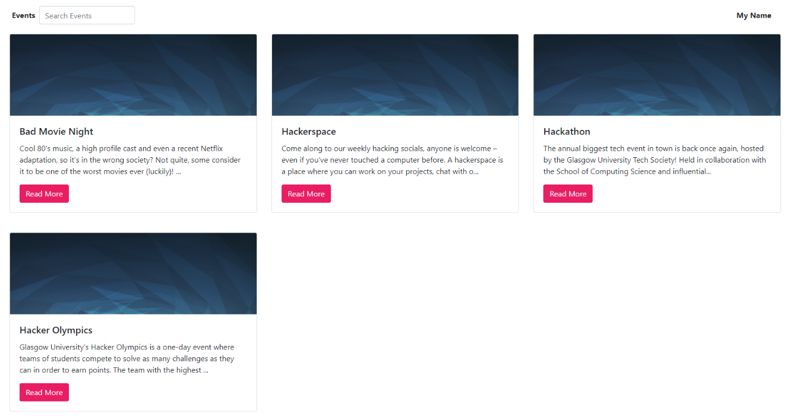
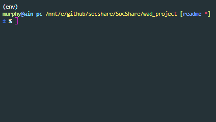
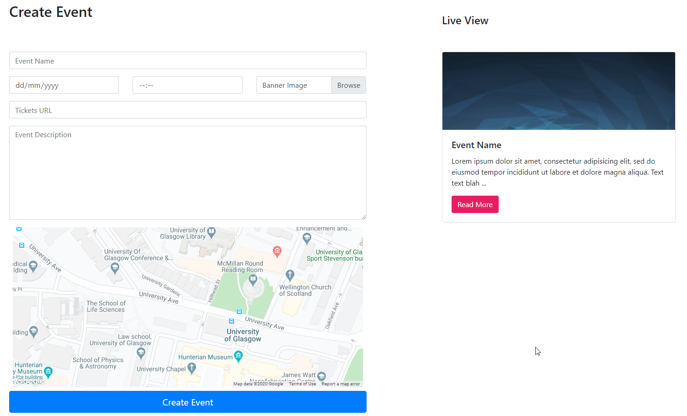

[![Contributors][contributors-shield]][contributors-url]
[![Stargazers][stars-shield]][stars-url]
[![Issues][issues-shield]][issues-url]
<br />
<p align="center">
    <a href="http://socshare.pythonanywhere.com">
        
    </a>
</p>

<!-- ABOUT THE PROJECT -->
## About The Project

<p align="center">
    
</p>

SocShare is a website for societies at the University of Glasgow. The site was built with both societies and students in mind: a central place for societies to advertise their events and somewhere for students to view all upcoming events.  
  
You can visit the website live at: http://socshare.pythonanywhere.com

### Built With
The major frameworks involved in creating the website:
* [Python 3.7](https://www.python.org/)
* [Django](https://www.djangoproject.com/)
* [Bootstrap](https://getbootstrap.com)
* [JQuery](https://jquery.com)

### Installation

1. Clone the repo
```sh
git clone https://github.com/SocShare/SocShare.git
```
2. Create a Python virtual environment (optional) with Python 3.6+
3. Install the required packages
```sh
pip install -r requirements.txt
```
4. You'll need to migrate the database before we can add the test data
```sh
cd wad_project
python manage.py makemigrations
python manage.py migrate
```
5. Run `population_script.py` to populate the database. This step may print out warnings to do with timezones, however they are not important as it is test data.
```sh
python population_script.py
```
6. Now it's time to run some tests to make sure the database is properly populated and the site is working as intended
```sh
python manage.py test socshare.tests
```
<p align="center">
    
</p>

7. Finally, you can run the server which is accessible at http://localhost:8000 by default
```sh
python manage.py runserver
```

<!-- USAGE EXAMPLES -->
## Usage

### Registering
In order to register an account with the site, your society must be affiliated with the SRC. We check this by searching for your society email on the [SRC website](https://www.glasgowstudent.net/clubs/find-a-club/). If we cannot find your society, then you will not be able to register a society account.  

If you do not own a society, you can browse the website anonymously. However, if you wish to leave a comment, you will need to login with your Google account. This is so we can stop any automated scripts and abuse of the comment area on events.

### Create an Event
To create an event, head to the **Dashboard** and scroll down to the *Create Event* section.
<p align="center">
    
</p>


<!-- ACKNOWLEDGEMENTS -->
## Acknowledgements
* [Google Authentication](https://github.com/googleapis/google-auth-library-python)
* [Cloudflare Scrape](https://github.com/Anorov/cloudflare-scrape)
* [Font Awesome](https://fontawesome.com)
* [Best README Template](https://github.com/othneildrew/Best-README-Template)


<!-- MARKDOWN LINKS & IMAGES -->
<!-- https://www.markdownguide.org/basic-syntax/#reference-style-links -->
[contributors-shield]: https://img.shields.io/github/contributors/SocShare/SocShare.svg?style=flat-square
[contributors-url]: https://github.com/SocShare/SocShare/graphs/contributors
[stars-shield]: https://img.shields.io/github/stars/SocShare/SocShare.svg?style=flat-square
[stars-url]: https://github.com/SocShare/SocShare/stargazers
[issues-shield]: https://img.shields.io/github/issues/SocShare/SocShare.svg?style=flat-square
[issues-url]: https://github.com/SocShare/SocShare/issues